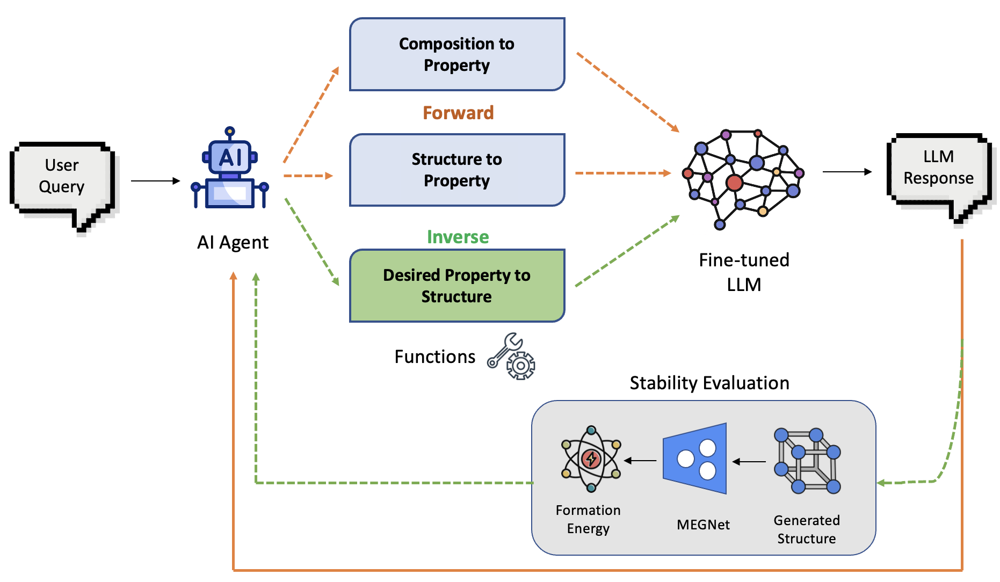

<div align="center">
  
</div>

## MAGE: Materials Agent for Generative and Evaluative Design

MAGE is a materials science agent focused on **property prediction and crystal structure generation**. The system uses fine tuned LLM to predict materials properties (such as bulk modulus) and generate crystal structures based on targeted property in CIF format, with additional formation energy analysis capabilities using M3GNet.

## Key Capabilities

- **Property Prediction**: Predict materials properties using fine-tuned LLM.
- **Structure Generation**: Generate crystal structures in CIF format based on target properties
- **3D Visualization**: Automatic visualization of generated structures using Crystal Toolkit
- **Formation Energy Analysis**: Thermodynamic stability assessment via MEGNet


## Workflow

<div align="center">
  
</div>

The MAGE system follows a streamlined workflow:

1. **Input**: User asks specific queries
2. **Prediction**: MAGE predicts Bulk Modulus based on composition or structure
3. **Structure Generation**: MAGE generates crystal structure in CIF format for target Bulk Modulus
4. **Visualization**: Crystal Toolkit automatically renders 3D structure
5. **Stability Analysis**: Formation energy analysis via MEGNet Model
6. **Results**: Integrated display of properties, structure, and stability metrics

## Demo Video

Watch our YouTube demo to see MAGE in action:  
[](https://youtu.be/mz8s9iZzuVo)

## Setup and Installation

### Prerequisites
- Python 3.11+

### Environment Setup

1. **Main Environment**:
   ```bash
   pip install -r requirements.txt
   ```

2. **Formation Energy Environment**:
   ```bash
   conda create -n matgl_env python=3.9
   conda activate matgl_env
   pip install matgl torch
   ```

### Starting the System

You will need **three separate terminals** open:  
one for the Formation Energy API server, one for the Crystal Toolkit server, and one for the MAGE web interface.

1. **Start Formation Energy API Server**:
   ```bash
   conda activate matgl_env
   cd "multi_tool_agent"
   python formation_energy_api.py
   ```
   Server runs on `http://localhost:5001`

2. **Start Crystal Toolkit Server**:
   ```bash
   # In a new terminal
   cd "multi_tool_agent"
   python -m crystal_toolkit.apps.examples.structure_viewer
   ```
   Crystal Toolkit runs on `http://localhost:8050`

3. **Launch Main Agent**:
   ```bash
   streamlit run app.py
   ```
   MAGE interface runs on `http://localhost:8501`


